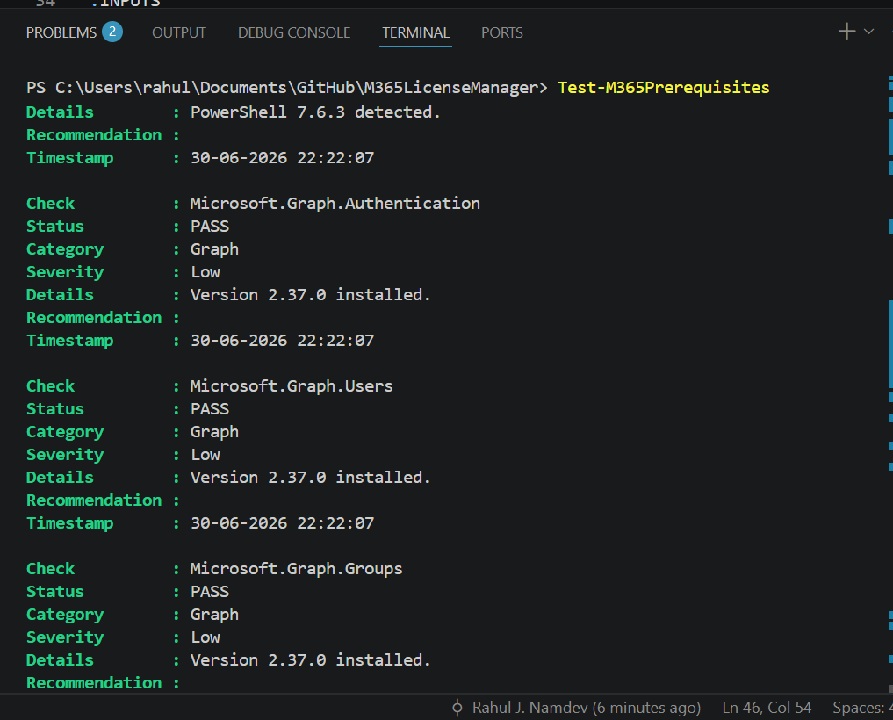
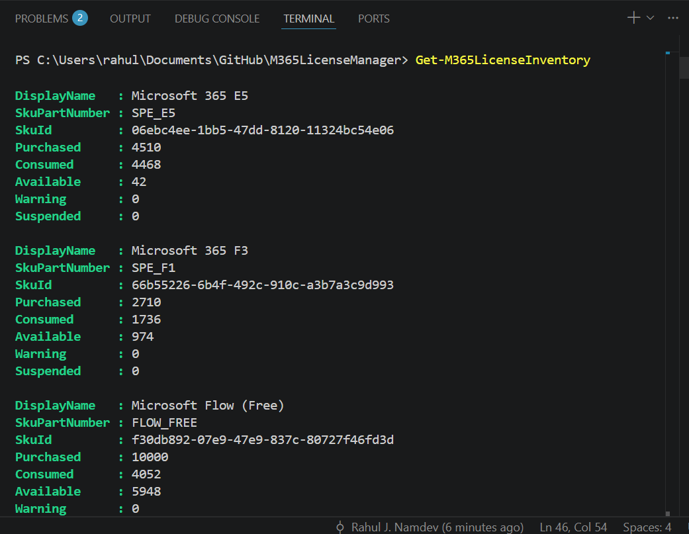
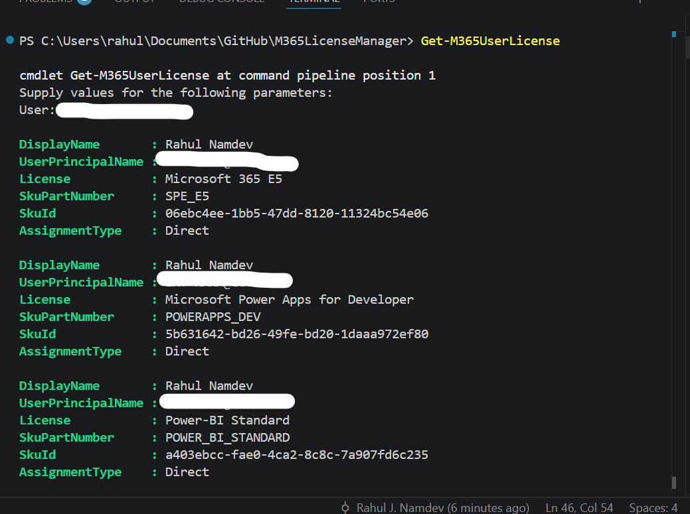
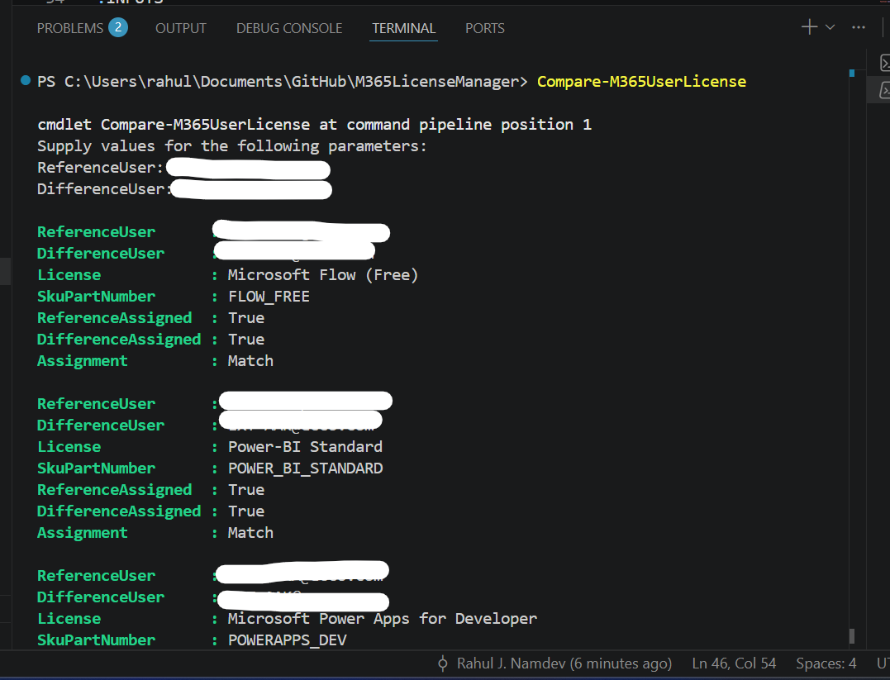

# M365LicenseManager

> A PowerShell module for managing Microsoft 365 licenses using Microsoft Graph.


---

## About the Project

Managing Microsoft 365 licenses through Microsoft Graph PowerShell often requires multiple commands, manual SKU lookups, and repetitive scripting.

**M365LicenseManager** simplifies these administrative tasks by providing reusable PowerShell cmdlets that abstract the complexity of Microsoft Graph while following PowerShell best practices.

The module is designed for Microsoft 365 administrators who want a simple, consistent, and automation-friendly experience when working with Microsoft 365 licenses.

---

## Features

- Microsoft Graph authentication
- Environment prerequisite validation
- Tenant license inventory
- User license inventory
- Assign Microsoft 365 licenses
- Remove Microsoft 365 licenses
- Copy licenses between users
- Compare license assignments
- Friendly SKU name resolution
- Supports `-WhatIf`
- Supports `-Verbose`
- Supports `-Confirm`
- Pipeline-friendly output
- Comment-based help for all public cmdlets

---

## Requirements

- PowerShell 7.2 or later
- Microsoft Graph PowerShell SDK
- Microsoft 365 tenant
- Appropriate Microsoft Graph permissions

---

## Installation

Clone the repository:

```powershell
git clone https://github.com/Rahulnamdev365/M365LicenseManager.git
```

Navigate to the project folder:

```powershell
cd M365LicenseManager
```

Import the module:

```powershell
Import-Module .\M365LicenseManager.psd1
```

---

## Getting Started

Connect to Microsoft Graph:

```powershell
Connect-M365License
```

Verify your environment:

```powershell
Test-M365Prerequisites
```

---

# Available Cmdlets

| Category | Cmdlet | Description |
|----------|---------|-------------|
| Connectivity | Connect-M365License | Connect to Microsoft Graph |
| Connectivity | Test-M365Prerequisites | Validate prerequisites |
| Inventory | Get-M365LicenseInventory | View tenant license inventory |
| Inventory | Get-M365UserLicense | View user license assignments |
| Management | Set-M365UserLicense | Assign or remove licenses |
| Management | Remove-M365UserLicense | Remove assigned licenses |
| Management | Copy-M365UserLicense | Copy licenses between users |
| Management | Compare-M365UserLicense | Compare license assignments |

---

# Examples

### View tenant licenses

```powershell
Get-M365LicenseInventory
```

---

### View a user's licenses

```powershell
Get-M365UserLicense `
    -User user@contoso.com
```

---

### Assign a license

```powershell
Set-M365UserLicense `
    -User user@contoso.com `
    -AddLicense SPE_E5
```

---

### Remove a license

```powershell
Remove-M365UserLicense `
    -User user@contoso.com `
    -License FLOW_FREE
```

---

### Copy licenses

```powershell
Copy-M365UserLicense `
    -SourceUser source.user@contoso.com `
    -TargetUser target.user@contoso.com
```

---

### Compare users

```powershell
Compare-M365UserLicense `
    -ReferenceUser reference.user@contoso.com `
    -DifferenceUser difference.user@contoso.com
```

---

# Screenshots

## Test-M365Prerequisites

Verify that your environment is ready before using the module.



---

## Get-M365LicenseInventory

View all Microsoft 365 licenses in your tenant, including purchased, consumed, and available units.



---

## Get-M365UserLicense

Retrieve all licenses assigned to a user, including assignment type and friendly license names.



---

## Compare-M365UserLicense

Compare license assignments between two users to quickly identify matching, missing, and extra licenses.



---

# Project Structure

```
M365LicenseManager
│
├── Public
│   ├── Connect-M365License.ps1
│   ├── Test-M365Prerequisites.ps1
│   ├── Get-M365LicenseInventory.ps1
│   ├── Get-M365UserLicense.ps1
│   ├── Set-M365UserLicense.ps1
│   ├── Remove-M365UserLicense.ps1
│   ├── Copy-M365UserLicense.ps1
│   └── Compare-M365UserLicense.ps1
│
├── Private
│
├── docs
│   └── images
│
├── Tests
│
├── M365LicenseManager.psd1
├── M365LicenseManager.psm1
└── README.md
```

---

# Roadmap

## v0.3.0

- Microsoft Graph connectivity
- Prerequisite validation
- Tenant license inventory
- User license inventory
- License assignment
- License removal
- License copy
- License comparison
- Comment-based help

---

## v0.4.0

- HTML reports
- CSV reporting
- License utilization dashboard
- License usage analytics

---

## v0.5.0

- Bulk CSV operations
- Group-based license reporting
- Logging
- Pester tests

---

## v1.0.0

- PowerShell Gallery release
- GitHub Actions CI/CD
- Complete documentation
- Automated testing
- Release pipeline

---

# Contributing

Contributions, suggestions, bug reports, and feature requests are welcome.

If you would like to contribute, please open an issue before submitting major changes.

---

# Support

If you find a bug or would like to request a feature, please create a GitHub Issue.

---

# License

This project will be released under the MIT License.

---

# Author

**Rahul Namdev**

Microsoft 365 Engineer

GitHub:
https://github.com/Rahulnamdev365